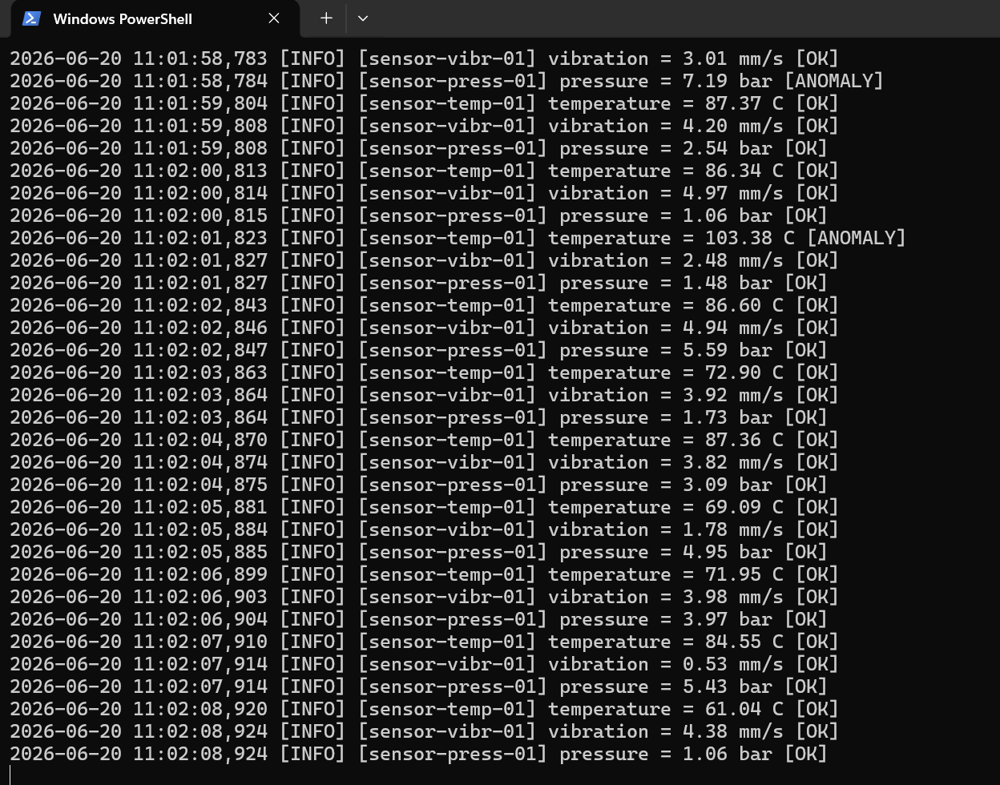
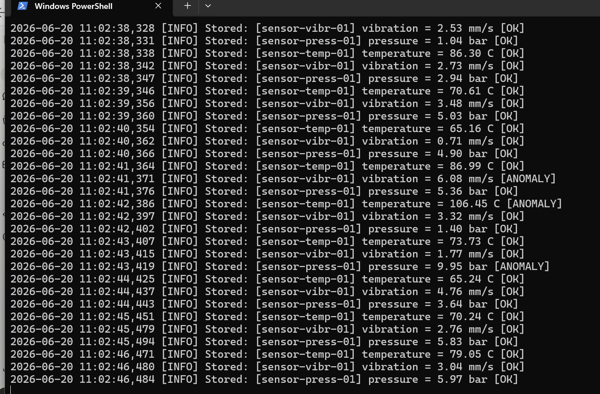
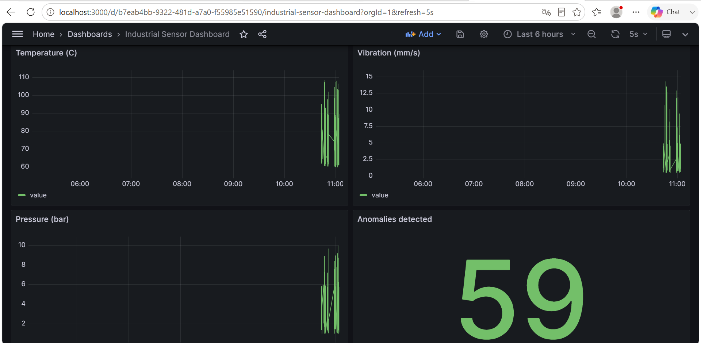

# Industrial Sensor Kafka Pipeline

Real-time industrial sensor data pipeline using Apache Kafka, PostgreSQL and Grafana.

## Architecture
Sensor Producer (Python)

|

v

Apache Kafka (broker)

|

|

|           |

v           v

Consumer DB  Consumer Alerts

(PostgreSQL) (sensor-alerts topic)

|

v

Grafana Dashboard

## Stack

- **Apache Kafka** — message broker for real-time sensor data streaming
- **Python** — sensor producer and consumers
- **PostgreSQL** — persistent storage for sensor readings
- **Grafana** — real-time dashboard with auto-provisioned datasource
- **Docker Compose** — orchestrates all services
- **GitHub Actions** — CI with lint (flake8) and integration tests

## Sensors simulated

| Sensor | Type | Normal range | Anomaly threshold |
|--------|------|-------------|-------------------|
| sensor-temp-01 | Temperature | 60-90 C | > 95 C |
| sensor-vibr-01 | Vibration | 0.5-5 mm/s | > 8 mm/s |
| sensor-press-01 | Pressure | 1-6 bar | > 8 bar |

Anomalies are randomly injected (5% probability) and detected by the alert consumer with two severity levels: MEDIUM and HIGH.

## Quick start

`ash
docker compose up -d
pip install -r requirements.txt
python producer/sensor_producer.py &
python consumer/consumer_db.py &
python consumer/consumer_alerts.py &
`

Open Grafana at http://localhost:3000 (admin/admin)

## CI/CD

Two jobs run on every push to main:
1. **Lint** — flake8 on producer and consumer code
2. **Integration test** — verifies Kafka producer/consumer and PostgreSQL connectivity

## Screenshots

## Author

Steve Meka